  

  <h2>Olá, eu sou o Lucas Gabriel 👋</h2>
  
Desenvolvedor Full Stack • estudante de Análise e Desenvolvimento de Sistemas

  
Crio aplicações web, APIs e automações. Tenho interesse especial em backend, Linux e segurança.

  
  
  

---

  
🔭 Atualmente desenvolvendo projetos próprios e aprofundando meus estudos em backend e segurança.

  
🐧 Uso Arch Linux no dia a dia e também tenho experiência com Kali Linux.

  
🤝 Aberto a oportunidades e colaborações em desenvolvimento de software.

### Tecnologias

  

### Ferramentas e sistemas

  

### Projetos em destaque

| Projeto | Descrição |
| --- | --- |
| [Sentinel Security Platform](https://github.com/blackxzin/sentinel-security-platform) | Monitoramento de atividades suspeitas e alertas de segurança. |
| [JobPilot AI](https://github.com/blackxzin/jobpilot-ai) | Ferramentas para analisar vagas, currículos e candidaturas. |
| [Escola Perímetro](https://github.com/blackxzin/cybersecurity-learn) | Trilhas e exercícios práticos de cibersegurança. |
| [LinuxDesk](https://github.com/blackxzin/linuxdesk) | Dispositivo Android como tela adicional para Linux. |
| [JurisFlow Local](https://github.com/blackxzin/jurisflow-local) | Organização de clientes, processos, tarefas e prazos. |
| [CV Analyzer API](https://github.com/blackxzin/cv-analyzer-api) | API para análise de currículos e comparação com vagas. |
| [FreelaHunter AI](https://github.com/blackxzin/freelahunter-ai) | Descoberta de oportunidades freelancer e preparação de propostas. |

### Minha atividade no GitHub

  

  
Quer conversar sobre um projeto? <a href="mailto:lucasgabriel4331@gmail.com">Envie um e-mail</a> ou fale comigo no <a href="https://www.linkedin.com/in/lucas-gabriel-787b19334/">LinkedIn</a>.

